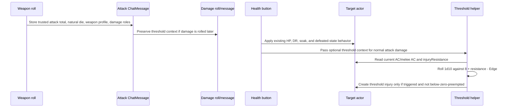

# Add SWNR Injury Die Thresholds

**Target repo:** `swnr`

## Overview

Adopt the intent of the user-provided WWN injury die threshold plan for this SWNR system, but map it onto SWNR's current V13 architecture and existing injury model. The feature adds an opt-in threshold injury system for normal personal weapon attacks:

```text
1d10 >= 8 + injuryResistance - edge
```

The core feature set is:

- A disabled-by-default world setting for threshold injuries.
- A manually edited actor stat, `injuryResistance`, for characters and NPCs.
- Trusted attack context stored in `ChatMessage` flags, not inferred from rendered chat HTML.
- Per-recipient injury checks when applying eligible attack damage from chat.
- Natural 20s count as Edge 3 for the injury die, but do not automatically create threshold injuries.
- Weapon damage profile affects severity after a trigger, not trigger chance.
- Existing HP loss, armor soak/DR, death-and-dismemberment below-zero wounds, trauma damage, shock damage, healing, and manual health drops remain separate unless explicitly eligible.

---

## Problem Frame

The WWN plan separates "does an injury happen?" from "how bad is it?" to avoid steep weapon-die probability curves and hard-to-explain multi-die edge cases. SWNR already has adjacent systems: optional critical hits, optional CWN trauma, optional death-and-dismemberment, actor injury counters, and embedded injury items. The implementation needs to reuse those surfaces without letting threshold injuries become a second accidental critical-hit system.

The key SWNR adaptation is that threshold injuries should be the above-zero attack-injury path when `useThresholdInjuries` is enabled. Current critical-hit damage can still exist under `useCriticalHits`, but the current above-zero `applyCriticalInjury` path must not also create an extra injury from the same threshold-eligible attack.

---

## Requirements Trace

- R1. Add a disabled-by-default world setting for threshold injuries.
- R2. Add explicit GM-facing `injuryResistance` to character and NPC actor data and sheets; do not infer it from armor, soak, trauma target, AC, or Active Effects.
- R3. Eligible positive normal personal attack damage resolves one threshold check per selected character or NPC recipient at damage-application time.
- R4. Injury chance uses `1d10 >= 8 + injuryResistance - edge`.
- R5. Edge is computed per recipient from stored attack total versus that recipient's current defense at damage application.
- R6. For standard SWNR AC, use current `system.ac`; when CWN armor is enabled and the trusted attack context identifies a melee weapon, use current `system.meleeAc`. For NPCs, `system.meleeAc` is a manually configured current defense in this pass; do not assume `actor-npc.mjs` derives it.
- R7. Natural 20s count as Edge 3 for threshold checks, independent of whether the separate SWNR critical-hit setting is enabled.
- R8. Natural 20s are not automatic threshold injuries.
- R9. Damage multipliers and alternate damage buttons, including SWNR's critical-damage application, affect HP only; threshold eligibility, Edge, weapon pressure, and pre-damage health pressure stay tied to the original normal attack context.
- R10. Shock, healing, trauma damage, context-menu/manual health changes, program damage, ship/vehicle damage, environmental damage, and non-weapon power damage do not trigger threshold injuries in this pass.
- R11. Existing below-zero death-and-dismemberment wound creation takes precedence over threshold injury creation for the same damage application.
- R12. Existing current HP damage, soak, DR, floating text, and defeated-state behavior remain unchanged when threshold injuries are disabled or context is invalid, except for an intentional global bug fix to selected-token routing: each selected token must receive its own per-target copy of the clicked damage amount and the loop must not return early after the first non-defeated target.
- R13. Threshold severity uses a lighter dedicated path and does not reuse the below-zero `1d12 + injuries * 2 + excess - critResistance` formula. V1 severity intentionally combines base weapon profile pressure, pre-damage health pressure, and capped existing-injury pressure before applying the threshold severity bands.
- R14. Minor threshold results do not increment the persistent injury counter; Moderate, Serious, and Severe results do.
- R15. Store authoritative attack and damage-role context on system-created chat message flags.
- R16. Preserve actor update permissions, source-message visibility, and idempotency when applying threshold injuries from chat buttons.
- R17. Add focused pure helper tests and Foundry QA coverage because SWNR currently lacks a first-class Node test suite for this behavior.
- R18. Do not automate Last Stand, death saves, or new HP 0 action-economy states in this pass.
- R19. V1 idempotency is best-effort for same-client repeated clicks and normal delayed re-clicks. It does not claim atomic multi-client duplicate prevention until a GM-mediated or otherwise serialized mutation path exists.

---

## Scope Boundaries

- Do not implement the old natural damage die threshold model.
- Do not make larger weapon dice more likely to trigger injuries.
- Do not derive `injuryResistance` from armor, soak, trauma target, AC, cyberware, foci, or Active Effects.
- Do not make shock, trauma, healing, manual damage, program damage, power damage, ship damage, vehicle damage, or environmental damage threshold-eligible.
- Do not add a post-trigger save.
- Do not add a GM-mediated socket mutation path in this pass.
- Do not change compendium actor defaults in this pass; default `injuryResistance` 0 means intentionally unprotected until a GM sets it.
- Do not remove the existing `useCriticalHits`, `useTrauma`, or `useDeathAndDismemberment` settings.
- Do not let critical-damage, shock, trauma, program, reroll, or manual damage spans become threshold-eligible just because they use `.roll-damage`.
- Do not edit `css/swnr.css` directly; any style changes go through `src/scss/`.

### Deferred to Follow-Up Work

- Automatic `injuryResistance` suggestions from armor, soak, NPC armor type, shields, cyberware, traits, or monster tags.
- Broader eligibility rules for powers, programs, environmental hazards, traps, vehicles, ships, or special attack tags.
- GM-mediated threshold mutation for non-GM users who can apply HP damage but cannot update the target actor.
- Atomic multi-client threshold attempt locking. Actor flags are acceptable as best-effort markers in v1, not as compare-and-set locks.
- Rich SWNR/CWN/AWN-specific injury effect tables beyond the first threshold severity bands.
- Compendium migration or content pass assigning recommended `injuryResistance` values to sample actors.

---

## Context & Research

### Relevant Code and Patterns

- `module/data/items/item-weapon.mjs` owns personal weapon attack rolls, damage roll creation, shock display, trauma display, natural 20 detection, critical-hit flags, and deferred damage-roll flags.
- `module/helpers/chat.mjs` adds health buttons to every `.roll-damage` element, applies health changes to selected tokens, handles soak/DR, and invokes death-and-dismemberment or critical-injury creation.
- `module/documents/actor.mjs` owns injury creation helpers, below-zero wound creation, critical injury creation, actor counter updates, and injury chat output.
- `module/data/actors/base-actor.mjs` already owns `critResistance`, `injuries`, and `wounds` for character and NPC data models through the base actor schema.
- `module/data/actors/actor-character.mjs` computes `system.ac` and, when CWN armor is enabled, `system.meleeAc`.
- `module/data/actors/actor-npc.mjs` computes NPC `system.ac`, supports optional CWN soak, and has NPC attack data.
- `templates/actor/header.hbs` shows AC, optional injury/wound counters, and character/NPC combat summaries.
- `templates/actor/npc.hbs` shows NPC base AC, optional melee AC, attacks, shock, trauma target, and the injury list.
- `templates/chat/attack-roll.hbs` and `templates/chat/damage-roll.hbs` render normal damage, critical damage, shock, and trauma using `.roll-damage`, so threshold eligibility cannot be inferred from that class alone.
- `templates/chat/injury-roll.hbs` is the existing injury chat template and can either be extended carefully or used as a pattern for a threshold-specific template.
- `module/helpers/register-settings.mjs` and `lang/en.json` hold the setting and localization patterns.
- `src/scss/components/_injuries.scss` holds injury-related styles; compiled CSS is generated by `npm run build`.

### Institutional Learnings

- `AGENTS.md` requires Foundry V13 ApplicationV2 patterns, no new jQuery-based UI, no new legacy `Dialog`, and SCSS source edits instead of direct `css/swnr.css` edits.
- `docs/dev/knownIssues.md` notes nearby technical debt but none blocks this feature. The known NPC armor AC issue is related but should not be solved by deriving `injuryResistance`.
- SWNR has no project-owned `tests/` directory today; the plan should create focused tests instead of assuming WWN's existing Mocha layout exists.

### External References

- No web research was used. The user-provided WWN plan and the two local repos were sufficient because this is a local rules/architecture adaptation, not a current external API or dependency question.

---

## Key Technical Decisions

- Use SWNR setting name `useThresholdInjuries` to match existing `useCriticalHits`, `useTrauma`, and `useDeathAndDismemberment` setting style.
- Store `injuryResistance` on the shared base actor schema so characters and NPCs get the same field and helper behavior. This means other actor types may carry a hidden default value, but threshold routing must ignore non-character/NPC recipients.
- Keep `injuryResistance` manually edited and defaulted to 0. This preserves the WWN plan's playtest posture and avoids encoding armor assumptions too early.
- Store threshold provenance in chat flags created by `module/data/items/item-weapon.mjs`. Rendered classes such as `.roll-damage` are too broad because they also include shock, trauma, and critical damage.
- Add explicit damage roles for chat-rendered roll elements and health buttons. The eligible role is the **validated normal attack action family**: normal, half-normal, and modified-normal damage with preserved provenance. Critical damage, shock, trauma damage, healing, program damage, power damage, reroll damage, and manual damage are HP-only.
- Preserve SWNR's existing HP mutation path in `applyHealthDrop`, but refactor the selected-token loop for all health applications so each target starts from the original clicked damage amount before per-target DR, soak, cyberdeck spillover, HP mutation, and threshold checks. This intentionally fixes the current shared-`total`/early-return multi-target bug even when threshold injuries are disabled.
- Use current target defense at damage application: `system.ac` for ordinary attacks; `system.meleeAc` only when CWN armor is enabled and trusted context says the source weapon is melee. For NPCs, `system.meleeAc` is the current manually configured field and QA must set it when testing melee CWN behavior.
- Treat current above-zero `applyCriticalInjury` as mutually exclusive with threshold injury checks for threshold-eligible attacks. This prevents a natural 20 from becoming both automatic critical injury and Edge 3 threshold chance.
- Keep critical damage doubling separate. If `useCriticalHits` is enabled, doubled damage can still affect HP and below-zero preemption, but clicking critical-damage HP application does not run a threshold attempt. Threshold attempts are consumed only by normal, half-normal, or modified-normal attack damage with valid provenance.
- Use embedded `injury` Item documents for triggered threshold injuries, matching existing SWNR injury UI.
- Persist best-effort threshold-attempt markers on the target actor in a dedicated flag namespace keyed by source message, damage action family, and target actor/token identity. Claim the marker before rolling or creating a threshold injury, with a last-moment duplicate check to reduce same-client double clicks and ordinary delayed re-clicks. Do not present this as atomic two-user locking.
- Add pure helper tests with a new lightweight test harness rather than trying to test Foundry UI behavior entirely through manual QA.

---

## Open Questions

### Resolved During Planning

- Should SWNR use WWN's AAC term directly? Resolution: no. SWNR uses current `system.ac`, with `system.meleeAc` only for trusted melee attacks when CWN armor is enabled.
- Should threshold injuries depend on SWNR's `useCriticalHits` setting? Resolution: no. Natural 20 Edge 3 is part of threshold logic regardless of the existing critical-hit setting.
- Should existing above-zero critical injuries also fire when threshold injuries are enabled? Resolution: no for threshold-eligible attacks; otherwise natural 20 would become an automatic injury source, contradicting the WWN plan.
- Should NPCs be first-class recipients? Resolution: yes. SWNR already has base injury counters and NPC injury list rendering.
- Should `injuryResistance` be inferred from armor or soak? Resolution: no. It is manually assigned in this pass.
- Should NPC melee AC be derived during this work? Resolution: no. The existing NPC model has `system.meleeAc` from the shared schema, but `actor-npc.mjs` does not derive it from armor. Treat it as manually configured current defense for v1 and document that QA must set it.
- Should actor flag markers guarantee no duplicate injuries across two simultaneous users? Resolution: no. Without GM-mediated mutation or atomic compare-and-set, actor flags are best-effort only. V1 prevents ordinary repeated clicks, not all multi-client races.

### Deferred to Implementation

- Exact helper names and module boundaries: implementation should choose names that fit the local code style.
- Exact threshold injury prose: implementation-owned as long as the severity bands, counter behavior, and player/GM visibility split are preserved.
- Exact flag schema version number: implementation-owned, but the required fields, validation rules, and snapshot minimization rules below are not optional.
- Exact test runner wiring: use the simplest maintainable project-owned harness, preferably Node's built-in test runner unless implementation discovers a stronger local reason to add a dependency.

---

## High-Level Technical Design

> This illustrates the intended approach and is directional guidance for review, not implementation specification. The implementing agent should treat it as context, not code to reproduce.



| Damage role | Threshold eligible? | Notes |
|---|---:|---|
| Normal attack damage | Yes | Uses trusted message context and selected target defense |
| Half normal attack damage | Yes | HP amount changes; threshold inputs stay from source attack |
| Modified normal attack damage | Yes only when it preserves normal attack provenance | Modifier changes HP only |
| Critical damage HP application | No | Critical damage may affect HP and below-zero preemption, but never rolls or consumes a threshold attempt |
| Shock | No | Existing below-zero wound behavior still applies if relevant |
| Trauma damage | No | Trauma remains separate |
| Healing | No | No threshold context |
| Manual/context damage | No | No trusted attack provenance |

**Eligible action family:** In the implementation units below, "validated normal attack action family" means normal attack damage, half-normal damage, and modified-normal damage that preserve trusted normal attack provenance. This is the only family that can roll or consume threshold attempts.

---

## Implementation Units

- U1. **Add Test Harness and Characterization Coverage**

**Goal:** Establish a project-owned way to verify pure threshold helpers and characterize existing damage behavior before changing routing.

**Requirements:** R12, R17

**Dependencies:** None

**Files:**
- Modify: `package.json`
- Create: `tests/node/injury-thresholds.test.mjs`
- Create: `tests/node/attack-context.test.mjs`
- Create if lightweight: `tests/node/health-drop-routing.test.mjs`
- Reference: `module/helpers/chat.mjs`
- Reference: `module/data/items/item-weapon.mjs`

**Approach:**
- Add a minimal Node test script and lightweight Foundry stubs only where pure helper tests require them.
- Prefer pure helper tests for threshold math, context validation, snapshot minimization, idempotency keys, and damage-role eligibility.
- Add `health-drop-routing.test.mjs` only if the selected-token loop can be covered with small stubs. Otherwise, document that routing coverage is handled by the manual Foundry QA checklist in U7.
- Keep browser/Foundry-only behavior in manual QA rather than overfitting Node stubs to Foundry internals.

**Execution note:** Characterization-first before modifying `module/helpers/chat.mjs`.

**Patterns to follow:**
- Existing `package.json` script style.
- Existing pure helper style in `module/helpers/utils.mjs`, where possible.

**Test scenarios:**
- Helper: normal attack damage is eligible only when validated provenance is present.
- Helper: critical, shock, trauma, healing, program, reroll, and manual roles are non-threshold.
- Helper: idempotency keys group normal, half-normal, and modified-normal damage into one action family.
- Helper: source item snapshots contain only the allowlisted fields required for threshold logic.
- Characterization: `.roll-damage` alone is insufficient to identify threshold eligibility because normal, shock, trauma, and critical damage all use it.

**Verification:**
- The implementer can run focused Node tests for new pure helpers and has documented manual QA coverage for Foundry-only behavior. The plan does not require building a full Foundry simulator.

---

- U2. **Add Setting, Actor Data, and Sheet Fields**

**Goal:** Add the opt-in setting and manual resistance stat before attack routing depends on them.

**Requirements:** R1, R2, R12, R16

**Dependencies:** None

**Files:**
- Modify: `module/helpers/register-settings.mjs`
- Modify: `module/data/actors/base-actor.mjs`
- Modify: `module/documents/actor.mjs`
- Modify: `module/sheets/actor-sheet.mjs`
- Modify: `templates/actor/header.hbs`
- Modify: `templates/actor/npc.hbs`
- Modify: `lang/en.json`
- Test: `tests/node/injury-thresholds.test.mjs`

**Approach:**
- Register `useThresholdInjuries` as a GM-configurable world setting, default `false`.
- Add `useThresholdInjuries` to `getGameSettings()` so actor sheets and templates can read it through the existing `gameSettings` context pattern.
- Add `injuryResistance` as a non-negative integer field on the base actor schema with default `0`.
- Display `injuryResistance` near AC and injury/wound counters for characters and NPCs in `templates/actor/header.hbs`.
- Place `injuryResistance` in the header combat stat row immediately after AC/melee AC and before the Inj/Wnd block. Label it `Injury Res.` in the compact header. Keep it visible on character and NPC sheets even when `useThresholdInjuries` is disabled so GMs can prep actors before enabling the rule.
- Do not add a second editable NPC `injuryResistance` control in `templates/actor/npc.hbs`; only update `npc.hbs` if needed for a read-only summary or to keep existing combat-stat layout coherent.
- Make the display consistent with existing header widgets and V13 form helpers.
- Make `injuryResistance` GM-facing: editable only when `game.user.isGM` is true; non-GM owners see a read-only value if the header area is visible, and limited/non-owner users do not get an editable input.
- Add an explicit `isGM` or `canEditInjuryResistance` context value in the actor sheet data rather than assuming the existing `editable`/`owner` flags mean GM authority.
- Protect the field at the actor update boundary as well as in the sheet. Non-GM updates to `system.injuryResistance` through macros, direct `actor.update`, or other document APIs must be stripped or rejected in `module/documents/actor.mjs`.
- Add localization for setting labels, hints, the field label, and helper text.

**Patterns to follow:**
- Setting registration in `module/helpers/register-settings.mjs`.
- Header resource blocks in `templates/actor/header.hbs`.
- NPC combat stat layout in `templates/actor/npc.hbs`.

**Test scenarios:**
- Happy path: `useThresholdInjuries` defaults to disabled.
- Happy path: character and NPC schemas default `injuryResistance` to `0`.
- Authorization: non-GM users cannot edit `injuryResistance` from the actor sheet in this pass.
- Authorization: non-GM users cannot change `system.injuryResistance` through direct actor updates or macros.
- Edge case: missing, blank, non-finite, or negative values normalize or validate to `0`.
- Regression: existing `useDeathAndDismemberment` injury/wound counter visibility remains unchanged unless threshold UI intentionally shares the same counter area.
- Regression: existing AC, melee AC, soak, and trauma target display remains unchanged.

**Verification:**
- A GM can open a character or NPC sheet and see/edit `injuryResistance` without enabling threshold injuries globally.

---

- U3. **Create Pure Threshold Math and Eligibility Helpers**

**Goal:** Isolate threshold trigger, Edge, severity pressure, and idempotency key logic in deterministic helpers.

**Requirements:** R3, R4, R5, R6, R7, R8, R9, R10, R13, R14, R16

**Dependencies:** U1, U2

**Files:**
- Create: `module/helpers/injury-thresholds.mjs`
- Reference: `module/swnr.mjs`
- Test: `tests/node/injury-thresholds.test.mjs`

**Approach:**
- Add helpers for:
  - actor `injuryResistance` lookup with safe default `0`;
  - defense lookup using current `system.ac` or current `system.meleeAc` for trusted melee CWN armor attacks;
  - Edge from attack margin: 0 for hit by 0-4, 1 for hit by 5-9, 2 for hit by 10+, 3 for natural 20;
  - negative margin as threshold-ineligible unless natural 20 applies;
  - target number `8 + injuryResistance - edge`, allowing values above 10 to be impossible on `1d10`;
  - damage-role eligibility for the validated normal attack action family only;
  - weapon pressure from static base weapon damage profile;
  - health pressure from the pre-damage HP snapshot;
  - existing injury pressure, capped at `+2`;
  - total severity pressure cap at `+4`;
  - threshold severity bands using `1d6 + totalPressure`;
  - idempotency key construction from source message, threshold action family, target actor, and target token where available.
- Keep helpers independent from rendered DOM and from Foundry UI APIs where practical.
- Treat weapon, health, and existing-injury pressure as intentional carry-over from the WWN source plan for v1 severity. These are now part of R13 and should not be replaced with a weapon-only severity model without a new planning decision.

**Patterns to follow:**
- Existing helper modules under `module/helpers/`.
- Existing `SWNShared` field helper style where validation needs schema support.

**Test scenarios:**
- Happy path: `injuryResistance` 0 with Edge 0 targets 8+.
- Happy path: `injuryResistance` 1 with Edge 1 targets 8+.
- Happy path: `injuryResistance` 2 with Edge 2 targets 8+.
- Edge case: `injuryResistance` 3 with Edge 0 targets 11+ and cannot trigger on `1d10`.
- Edge case: natural 20 uses Edge 3 even if attack margin is low.
- Edge case: attack total below current AC skips threshold logic unless natural 20 context is present.
- Edge case: melee attacks use current `system.meleeAc` only when CWN armor is enabled and the trusted source says the weapon is melee.
- Edge case: normal SWNR attacks use current `system.ac`.
- Happy path: d4/d6 weapon profiles produce lighter severity pressure.
- Happy path: d8 weapon profiles produce neutral severity pressure.
- Happy path: d10/d12/2d6 weapon profiles produce heavier severity pressure.
- Edge case: unparseable weapon formula falls back to neutral weapon pressure.
- Severity: Minor does not increment persistent injuries.
- Severity: Moderate, Serious, and Severe increment persistent injuries once.
- Idempotency: normal, half, and modified normal damage share one threshold action family for the same source attack.
- Idempotency: marker payloads are minimal and opaque; they contain no actor names, item names, target defenses, injury math, hidden token UUIDs, or GM-only message details.

**Verification:**
- Threshold math can be reviewed and tested without a running Foundry world.

---

- U4. **Capture Trusted Attack and Damage Role Context**

**Goal:** Store enough system-owned provenance on attack and deferred damage messages so damage application can validate threshold eligibility without scraping HTML.

**Requirements:** R3, R5, R6, R7, R8, R9, R10, R15, R16

**Dependencies:** U3

**Files:**
- Modify: `module/data/items/item-weapon.mjs`
- Modify: `module/helpers/chat.mjs`
- Modify: `templates/chat/attack-roll.hbs`
- Modify: `templates/chat/damage-roll.hbs`
- Reference only unless a concrete bug remains after default-deny routing: `templates/chat/program-roll.hbs`
- Reference only unless a concrete bug remains after default-deny routing: `templates/chat/power-usage.hbs`
- Reference only unless a concrete bug remains after default-deny routing: `templates/chat/re-roll.hbs`
- Test: `tests/node/attack-context.test.mjs`

**Approach:**
- Store a versioned `flags.swnr.thresholdAttack` payload on system-created weapon attack messages.
- Include full attack total from `hitRoll.total`, natural attack die result from the base die, source actor id/uuid, source item id/uuid, base weapon damage formula before burst and situational additions, whether the source weapon is melee, whether the damage is personal-scale weapon damage, and original roll visibility data needed for follow-up messages.
- Do not use the current `rollData.hitRoll` value as the stored attack total; the current code sets that value from the base die result. Store attack total and natural die result as separate fields.
- For actor-owned embedded weapons, store and rehydrate the source item via `this.parent.uuid` or an equivalent actor-owned item UUID. Do not rely on `game.items.get(itemId)` for embedded actor items.
- Include a minimized source snapshot for fallback when the original item cannot be resolved. The snapshot allowlist is: display name, base damage formula, melee boolean, personal-scale weapon boolean, and any small scalar needed to recompute weapon pressure. Do not copy the full item `system` object, actor data, secrets, or GM-only notes into public chat flags.
- Validate provenance before threshold use: expected schema version, SWNR roll type/module marker, `message.speaker.actor` matching the source actor UUID, source item embedded in that actor or a valid minimized snapshot, message author having GM/owner permission over the source actor at roll creation time where available, applying user having permission to mutate the target actor, and damage role consistency. Any mismatch fails closed for threshold logic.
- Acknowledge the trust boundary: ChatMessage flags are ordinary client-visible data, so they are not a privilege source. They may prove routing context only after the actor/item/speaker/permission checks above pass; they must never allow a user to mutate a target actor they could not otherwise update.
- If implementation cannot verify source author permission or source actor/item consistency through available Foundry APIs, fail threshold mutation closed for non-GM users in v1. A GM may still apply threshold mutation from a validated system roll because GM authority is the trust boundary.
- Mark rendered damage rolls with explicit damage roles. Do not use `.roll-damage` as eligibility.
- U4 is a hard prerequisite for U5. Add per-element damage role/context before changing health routing so U5 never relies on message-wide `isCriticalHit` for threshold eligibility or critical-injury suppression.
- Preserve threshold context when `damageRoll` is disabled and `_onDmgRollClick` creates a separate damage message. The newly created damage `ChatMessage` must receive threshold flags for normal attack damage even when the roll is not critical.
- Treat normal damage, half damage, and modified normal damage as one threshold action family when provenance is valid.
- Mark shock, trauma, healing, program damage, reroll damage, power damage, manual-only health changes, and critical-damage HP application as non-threshold roles.
- Default-deny threshold logic in `module/helpers/chat.mjs`: if a `.roll-damage` element has no validated normal attack role and trusted threshold context, health buttons remain HP-only. Prefer this central default-deny behavior over editing unrelated program/power/reroll templates solely to add non-threshold markers.
- Validate flags before threshold use. Missing, stale, malformed, user-authored, or inconsistent context fails closed for threshold logic while preserving HP behavior.

**Patterns to follow:**
- Existing `flags.swnr.isCriticalHit` and deferred `flags.swnr.damageRoll` flow.
- Existing attack and damage chat templates.

**Test scenarios:**
- Happy path: auto-rolled normal attack damage carries attack total, natural die, source actor, source item, base weapon formula, melee flag, and damage role.
- Happy path: stored attack total equals `hitRoll.total`; stored natural die equals the base die result.
- Happy path: deferred damage roll preserves threshold context onto the damage message.
- Happy path: natural 20 context is present even when `useCriticalHits` is disabled.
- Regression: critical-damage HP application never rolls or consumes a threshold attempt.
- Edge case: burst fire affects HP damage but base weapon formula is preserved for severity pressure.
- Edge case: shock, trauma, program, power, reroll, and manual roll spans are explicitly non-threshold or default to HP-only when no trusted context exists.
- Error path: missing or unresolvable embedded source item falls back to a system-created source item snapshot when available.
- Security: editing rendered HTML cannot forge threshold eligibility.
- Security: malformed message flags skip threshold processing and still allow ordinary HP application.
- Security: source item snapshots are minimized to the allowlisted fields.
- Regression: current message-wide `isCriticalHit` cannot make shock, trauma, critical damage, or other non-normal damage threshold-eligible.

**Verification:**
- Clicking a damage health button can rehydrate trusted threshold context from message data, not from CSS classes or labels.

---

- U5. **Route Health Application Through Threshold Checks**

**Goal:** Extend health-button damage application so eligible normal attack damage runs one threshold attempt per selected target after preserving existing HP behavior.

**Requirements:** R3, R5, R6, R7, R8, R9, R10, R11, R12, R16, R18, R19

**Dependencies:** U3, U4

**Files:**
- Modify: `module/helpers/chat.mjs`
- Modify: `module/documents/actor.mjs`
- Test if lightweight stubs were added: `tests/node/health-drop-routing.test.mjs`
- Manual QA: `docs/dev/threshold-injuries-qa.md`

**Approach:**
- Extend health button creation so each button knows its damage role and optional threshold context.
- Extend `applyHealthDrop` with an optional context argument while preserving existing callers.
- At the start of each selected-token iteration, copy the original clicked damage amount into a per-target local value. Apply cyberdeck spillover, DR, armor soak, NPC soak, HP mutation, and threshold decisions against that per-target value only. Do not let one selected target's mitigation change the damage amount seen by later selected targets.
- Fix the existing early-return behavior in the selected-token loop: when a target does not need defeated-state changes, continue to the next selected token instead of returning from `applyHealthDrop`.
- Treat the per-target damage clone and early-return fix as a shared health-button bug fix that applies regardless of `useThresholdInjuries`.
- Capture pre-damage HP, existing injury count, and target defense before HP mutation.
- Apply existing DR, soak, HP update, floating text, death-and-dismemberment, and defeated-state behavior first.
- Detect below-zero wound preemption with an explicit per-target outcome value. Either have the wound path return `{ woundApplied: true }` or set an equivalent local boolean immediately before calling `applyWounds`; do not infer preemption after the fact from chat output.
- When threshold injuries are enabled and context validates, run one threshold attempt per selected character/NPC target.
- Skip threshold logic for cyberdecks, ships, vehicles, drones, mechs, factions, and any non-character/NPC recipient.
- If `useThresholdInjuries` is enabled, suppress the current above-zero `applyCriticalInjury` call for threshold-eligible normal attack damage. Keep it available for non-threshold contexts if current behavior requires it.
- Before rolling the threshold die or creating a threshold injury, claim the threshold attempt marker on the target actor for the source message/action family/target key. If the marker already exists, skip threshold processing and keep HP behavior unchanged.
- Re-check the marker immediately before injury creation. If another already-visible marker exists, skip creation and report a duplicate-skip only to the GM.
- This marker approach is best-effort, not atomic. It is expected to prevent ordinary same-client repeated clicks and delayed re-clicks. It does not guarantee no duplicates from two simultaneous clients until GM-mediated or serialized mutation is added in follow-up work.
- Persist threshold attempt markers whether or not the injury die succeeds.
- Store markers as opaque minimal data only: hashed or compact key, boolean claimed/attempted value, timestamp if useful for pruning, and schema version. Do not store source actor name, item name, target defense, injury math, hidden token UUIDs, or GM-only message details.
- Require actor update permission for threshold marker and injury mutation in this pass.
- Return or collect a per-target routing outcome with at least: `hpApplied`, `thresholdEligible`, `thresholdAttempted`, `thresholdTriggered`, `thresholdSkippedReason`, `woundApplied`, and `duplicate`. Use this to produce clear GM-only summaries for multi-target partial success, permission failure, duplicate, validation failure, and below-zero preemption.
- Emit concise GM-only skipped-threshold notes only when a normal attack looked threshold-eligible but validation, permission, duplicate, or below-zero-preemption prevented threshold mutation.
- Use per-element role/context only for threshold routing and critical-injury suppression decisions. Do not use message-wide `flags.swnr.isCriticalHit` or nearby DOM critical markers to decide whether a specific roll element is threshold-eligible.

**Health button states:**

| State | Applies when | User-facing behavior |
|---|---|---|
| HP-only | No validated normal attack action family context | Existing health buttons work normally; tooltip/accessibility name does not mention threshold |
| Threshold eligible | Validated normal attack action family context exists | Existing health buttons work normally; tooltip may mention threshold attempt for normal/half/modified damage |
| Applying | Button click is in flight | Disable clicked button until the operation resolves |
| Applied/consumed | HP applied and threshold marker claimed for that target/action family | Leave HP buttons usable for HP if current behavior requires, but threshold logic must skip duplicates |
| Duplicate skipped | Marker already exists | Keep HP behavior unchanged; GM-only diagnostic may mention duplicate threshold skip |
| Permission blocked | User lacks target mutation permission for marker/injury | HP behavior follows existing permissions; threshold mutation skips with GM-only diagnostic |
| Invalid provenance | Context fails validation | HP behavior remains; threshold mutation skips with GM-only diagnostic only if the attack looked eligible |

**Patterns to follow:**
- Existing selected-token loop and HP mutation in `module/helpers/chat.mjs`.
- Existing `applyWounds` and `applyCriticalInjury` boundaries in `module/documents/actor.mjs`.

**Test scenarios:**
- Happy path: eligible normal attack damage applies HP and runs one threshold check for one selected character.
- Happy path: one attack damage message applied to two selected targets runs independent checks using each target's current defense and `injuryResistance`.
- Happy path: current AC changes between attack roll and damage application affect Edge by design.
- Happy path: current melee AC is used for trusted melee attacks when CWN armor is enabled.
- Edge case: half damage changes HP loss only and uses the same threshold context.
- Edge case: modified normal damage changes HP loss only when provenance is preserved.
- Edge case: critical-damage HP application changes HP only and never rolls or consumes a threshold attempt.
- Edge case: natural 20 uses Edge 3 but still rolls `1d10`.
- Edge case: attack total below current target defense applies HP and skips threshold logic unless natural 20 context is present.
- Edge case: shock, trauma, healing, program damage, power damage, reroll damage, and manual health changes never run threshold logic.
- Edge case: target reduced to 0 HP with below-zero wound creation skips threshold injury creation.
- Authorization: a user without target actor update permission cannot persist threshold injuries or markers.
- Idempotency: repeated clicks from the same source message, threshold action family, and target do not reroll threshold injuries.
- Idempotency: ordinary same-client repeated clicks do not create two threshold injuries for the same source message/action family/target.
- Multi-target: a mitigated first target does not change HP loss or threshold inputs for the second selected target.
- Regression: disabled `useThresholdInjuries` preserves existing HP, soak, DR, wounds, critical injuries, floating text, and defeated-state behavior, except that selected-token routing now correctly processes every selected token with an independent damage amount.

**Verification:**
- Existing health buttons still work, and threshold checks appear only for validated normal attack damage when the setting is enabled.

---

- U6. **Create Threshold Injuries and Chat Output**

**Goal:** Create threshold-specific injury items, update counters according to severity, and report visible outcomes without overusing the existing below-zero wound formula.

**Requirements:** R11, R13, R14, R16

**Dependencies:** U5

**Files:**
- Modify: `module/documents/actor.mjs`
- Modify: `module/data/items/item-injury.mjs`
- Create: `templates/chat/threshold-injury-roll.hbs`
- Modify: `lang/en.json`
- Modify: `src/scss/components/_injuries.scss`
- Test: `tests/node/injury-thresholds.test.mjs`
- Test if lightweight stubs were added: `tests/node/health-drop-routing.test.mjs`
- Manual QA: `docs/dev/threshold-injuries-qa.md`

**Approach:**
- Add a threshold-specific actor method that creates embedded `injury` items without reusing `applyWounds`.
- Extend injury item schema choices to include threshold severity types such as `thresholdMinor`, `thresholdModerate`, `thresholdSerious`, and `thresholdSevere`.
- Extend threshold injury item display and derived text so threshold types do not reuse the existing critical/wound effect semantics blindly. `mechanicalEffect`, duration display, list labels, and item detail labels must distinguish threshold Minor/Moderate/Serious/Severe from current critical and wound injuries.
- Use severity bands:

| Severity score | Band | Persistent injury counter? |
|---:|---|---:|
| 3 or less | Minor | No |
| 4-5 | Moderate | Yes |
| 6-7 | Serious | Yes |
| 8+ | Severe | Yes |

- Increment `system.injuries` only for persistent bands. Do not increment `system.wounds` for ordinary threshold injuries in this pass.
- Create an embedded injury item for every triggered result, including Minor. Minor items are visible records but do not increment the persistent injury counter.
- Create threshold chat output according to the source message visibility, with target label, source weapon, severity band, location/effect fallback, and concise injury narration.
- If the target token is hidden, the actor is not observable by the message recipients, or the source message is blind/GM-only, the player-facing output must be GM-only or use an anonymized label such as `Hidden target`.
- Put mechanical details that can reveal target defenses or state behind GM-only visibility: target number, Edge source, `injuryResistance`, pre-damage health pressure, existing-injury pressure, and full pressure summary.
- Preserve source message visibility for threshold injury output by passing the source message's `whisper`, `blind`, and roll-mode-equivalent visibility into the threshold creation method. Do not use `_createInjury`'s current core-roll-mode behavior as-is for threshold output.
- Keep no-trigger outcomes quiet for players; use GM-only diagnostics only for validation, permission, duplicate, or below-zero-preemption failures.
- Do not emit normal no-trigger threshold rolls to players. For GMs, include no-trigger results only in the compact per-target summary when a threshold attempt was actually made.
- Use a compact GM summary for multi-target applications when any target triggers, skips, or errors:
  - `Target`: visible/anonymized target label
  - `HP`: applied HP delta after mitigation
  - `Threshold`: rolled result, impossible target number, or `not attempted`
  - `Result`: trigger band, no trigger, or skip reason
- Use SCSS source if new styling is needed, then compile CSS during implementation.

**Minimum chat copy shape:**

| Band | Public/source-visible copy shape |
|---|---|
| Minor | `{Target} suffers a minor injury from {Weapon}: {Location}.` |
| Moderate | `{Target} suffers a moderate injury from {Weapon}: {Location}.` |
| Serious | `{Target} suffers a serious injury from {Weapon}: {Location}.` |
| Severe | `{Target} suffers a severe injury from {Weapon}: {Location}.` |

Implementation may improve wording, but it must keep severity, source, and location readable without color.

**Patterns to follow:**
- Existing `_createInjury`, `_rollInjuryLocation`, and `templates/chat/injury-roll.hbs`.
- Existing injury list display through embedded `injury` items.

**Test scenarios:**
- Happy path: triggered Minor injury creates visible output but does not increment `system.injuries`.
- Happy path: triggered Minor injury creates an embedded injury item.
- Happy path: triggered Moderate injury creates one injury item and increments `system.injuries` once.
- Happy path: Serious and Severe threshold injuries increment `system.injuries` once and do not increment `system.wounds`.
- Happy path: threshold Minor/Moderate/Serious/Severe item sheets and injury lists show threshold-specific labels/effects rather than current critical/wound labels.
- Happy path: existing injury count contributes severity pressure capped at `+2`.
- Happy path: pre-damage HP at or below half contributes severity pressure.
- Happy path: d10/d12/2d6 weapon pressure can push severity upward after trigger.
- Edge case: natural 20 adds no severity pressure beyond its trigger Edge.
- Edge case: unparseable weapon formula uses neutral pressure and still creates a valid threshold output.
- Visibility: public, GM-only, and blind attack messages produce matching follow-up visibility.
- Visibility: public player output does not expose NPC `injuryResistance`, target number, Edge math, or HP/injury pressure unless the source message was already GM-only.
- Visibility: hidden or unobservable target tokens are not named in public output.
- Accessibility: severity output includes text labels and is understandable without color.
- Accessibility: injected health buttons and threshold chat controls use `type="button"` where applicable, have accessible names or labels, keep tooltip text aligned with accessible names, use real disabled state while applying, remain keyboard-focusable when interactive, and do not overflow narrow actor sheet or chat card layouts.
- Regression: below-zero wound chat output remains unchanged.

**Verification:**
- Triggered threshold injuries produce embedded injury items and clear chat output without changing the existing below-zero wound result shape.

---

- U7. **Document and Manually QA the SWNR Rule**

**Goal:** Verify the feature in Foundry and document the GM-facing rule, tuning assumptions, and non-goals.

**Requirements:** R1-R19

**Dependencies:** U1, U2, U3, U4, U5, U6

**Files:**
- Modify: `README.md`
- Reference: `docs/dev/knownIssues.md`
- Create: `docs/dev/threshold-injuries-qa.md`
- Test: manual Foundry QA checklist in `docs/dev/threshold-injuries-qa.md`

**Approach:**
- Document the rule:
  - eligible normal attack damage rolls `1d10`;
  - target number is `8 + injuryResistance - edge`;
  - Edge comes from attack margin, with natural 20 as Edge 3;
  - weapon damage profile affects severity only;
  - `injuryResistance` is manually assigned for playtesting;
  - default `0` means intentionally unprotected, not unconfigured.
- Document the relationship with existing SWNR toggles:
  - threshold injuries are separate from `useCriticalHits`;
  - threshold injuries suppress current above-zero critical injury creation for threshold-eligible attacks;
  - death-and-dismemberment below-zero wounds remain higher precedence;
  - trauma remains non-threshold in this pass.
- Add a QA checklist covering character and NPC recipients, AC/melee AC, natural 20, half/modified damage, shock, trauma, healing, duplicate clicks, public/GM/blind visibility, unauthorized users, and below-zero preemption.
- Include deferred-damage QA for embedded actor weapons with `damageRoll` disabled, including a deleted/unresolvable source item fallback case.
- Include manual QA for NPC melee CWN attacks with `system.meleeAc` explicitly configured on the NPC.
- Include manual QA for hidden/unobservable target tokens and anonymized or GM-only threshold output.
- Update `docs/dev/knownIssues.md` only if implementation discovers related technical debt that remains unfixed.

**Patterns to follow:**
- Existing `docs/dev/knownIssues.md` style.
- Existing README organization.

**Test scenarios:**
- Manual QA: `injuryResistance` 0 no-Edge target triggers on 8+.
- Manual QA: `injuryResistance` 2 no-Edge target triggers on 10+.
- Manual QA: `injuryResistance` 3 no-Edge target cannot trigger on `1d10`.
- Manual QA: natural 20 against `injuryResistance` 3 uses Edge 3 and triggers on 8+.
- Manual QA: attack total 19 against AC 14 gives Edge 1.
- Manual QA: attack total 24 against AC 14 gives Edge 2.
- Manual QA: attack total below current AC applies HP and skips threshold logic.
- Manual QA: melee attack with CWN armor enabled uses melee AC.
- Manual QA: NPC melee attack defense uses the NPC's configured `system.meleeAc`; the test actor should set this value explicitly.
- Manual QA: same attack message applied to two selected targets uses each target's current defense and resistance.
- Manual QA: shock, trauma, healing, program damage, power damage, reroll damage, manual damage, and critical-damage HP application do not create threshold attempts.
- Manual QA: repeated clicks do not reroll threshold attempts.
- Manual QA: same-client repeated clicks do not reroll threshold attempts.
- Manual QA: note that two simultaneous users can still race in v1; this is a known residual risk until GM-mediated mutation exists.
- Manual QA: setting disabled preserves current behavior.

**Verification:**
- The GM can enable the setting, assign representative resistance values, run personal weapon attacks, and observe threshold behavior matching the documented tables and helper tests.

---

## System-Wide Impact

- **Interaction graph:** `module/data/items/item-weapon.mjs` creates trusted context; `module/helpers/chat.mjs` rehydrates it from chat messages and applies HP; `module/documents/actor.mjs` owns injury mutation and chat output.
- **Error propagation:** Threshold validation failures should skip threshold logic and preserve ordinary HP changes, with GM-only diagnostics for eligible-looking attacks.
- **State lifecycle risks:** Duplicate clicks, delayed damage clicks after AC changes, multi-target application, and partial permission failures are the main state risks.
- **API surface parity:** Character and NPC actors must both support `injuryResistance`, threshold attempts, and injury item creation.
- **Integration coverage:** Pure helper tests cover math; manual Foundry QA must cover rendered chat, selected tokens, visibility, actor permissions, and embedded item creation.
- **Unchanged invariants:** Existing HP, soak, DR, trauma, shock, critical damage, below-zero wounds, defeated overlays, and injury item display remain available outside validated threshold injury handling.

---

## Risks & Dependencies

| Risk | Mitigation |
|------|------------|
| Existing `.roll-damage` buttons make shock/trauma accidentally eligible | Add explicit damage roles and validate trusted message flags before threshold processing |
| Natural 20 creates both current critical injury and threshold injury | Suppress above-zero `applyCriticalInjury` for threshold-eligible attacks when `useThresholdInjuries` is enabled |
| Critical damage doubling indirectly changes threshold severity | Use pre-damage HP snapshot and base weapon profile; let doubled damage affect HP and below-zero preemption only |
| Deferred damage loses source weapon context | Store actor-owned item UUIDs, rehydrate embedded items correctly, and keep a minimized snapshot fallback |
| Public chat reveals hidden NPC mechanics or hidden target identity | Split source-visible injury narration from GM-only threshold math; anonymize or GM-only hidden/unobservable targets |
| Repeated chat button clicks create duplicate injuries | Claim best-effort threshold attempt markers before rolling/creating injury and re-check before creation |
| Two simultaneous users create duplicate threshold injuries | Accepted v1 residual risk; true prevention requires GM-mediated or serialized mutation, which is deferred |
| Multi-target application shares mutated damage totals | Clone the original clicked damage amount for each selected token before per-target mitigation and threshold routing |
| Existing multi-target loop returns after first non-defeated token | Fix selected-token loop globally as part of U5; this is an intentional health-button bug fix, not threshold-only behavior |
| Unauthorized users apply HP but cannot update threshold state | Preserve current HP behavior and skip threshold mutation with GM-only note |
| No existing SWNR Node test suite | Add a minimal project-owned harness for pure helpers and keep Foundry UI behavior in manual QA |
| GM assumes default resistance 0 means unconfigured | Document that 0 is intentional unprotected/light protection and playtest actors need assigned values |
| Threshold injury text becomes too punitive | Start with light severity bands and make Minor non-persistent |

---

## Alternative Approaches Considered

- Natural damage die threshold: rejected because the WWN source plan moved away from weapon-die trigger probabilities and multi-die ambiguity.
- Reusing SWNR critical hits directly: rejected because the current critical-injury path is automatic on eligible natural 20s and conflicts with the intended Edge 3 injury die.
- Deriving resistance from armor/soak: rejected for v1 because SWNR has multiple armor modes and an existing known NPC armor AC issue; manual assignment is clearer for playtesting.
- Making trauma threshold-eligible: rejected for v1 because trauma already has its own damage multiplier semantics and would blur source eligibility.
- Socket-mediated GM mutation: deferred because v1 intentionally accepts direct actor update permission and best-effort idempotency while validating the core rule. This means atomic multi-client duplicate prevention is out of scope for v1.

---

## Documentation / Operational Notes

- Add GM-facing documentation before playtest, not after tuning.
- Manual QA should record attack total, current AC/melee AC, Edge, natural 20, resistance, injury die result, severity band, existing injury count, and whether below-zero wounds preempted threshold handling.
- V1 actor-flag idempotency is best-effort. Do not present it as protection against simultaneous multi-user races in release notes or user documentation.
- Do not tune the base target from 8+ until playtest data includes representative `injuryResistance` values from 0-3.
- Any visual styling work must modify `src/scss/` and then compile with `npm run build`.

---

## Sources & References

- External source plan supplied by user: `2026-05-13-001-feat-wwn-injury-dice-thresholds-plan.md`
- External WWN source comparison paths under `/Users/personal/code/wwn`: `module/dice.js`, `module/chat.js`, `module/actor/entity.js`, `module/item/chat-cards.mjs`, `module/data/actor/character.mjs`, `module/data/actor/monster.mjs`, `templates/chat/roll-attack.hbs`
- SWNR related code: `module/data/items/item-weapon.mjs`
- SWNR related code: `module/helpers/chat.mjs`
- SWNR related code: `module/documents/actor.mjs`
- SWNR related code: `module/data/actors/base-actor.mjs`
- SWNR related code: `module/data/actors/actor-character.mjs`
- SWNR related code: `module/data/actors/actor-npc.mjs`
- SWNR related code: `module/helpers/register-settings.mjs`
- SWNR related code: `templates/actor/header.hbs`
- SWNR related code: `templates/actor/npc.hbs`
- SWNR related code: `templates/chat/attack-roll.hbs`
- SWNR related code: `templates/chat/damage-roll.hbs`
- SWNR related code: `templates/chat/injury-roll.hbs`
- SWNR docs: `docs/dev/knownIssues.md`
