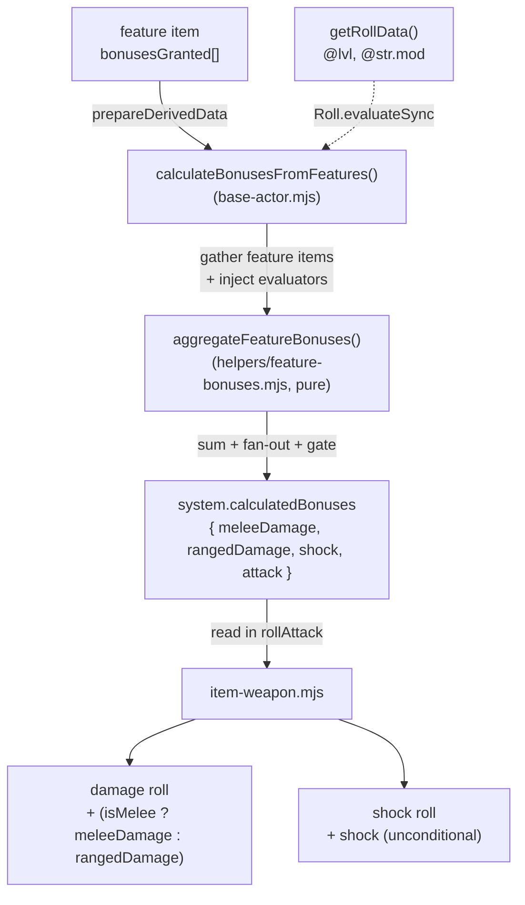

# feat: Generalized feature damage/shock bonuses (`bonusesGranted`)

## Summary

Add a declarative, formula-driven bonus system to SWNR `feature` items so that foci/edges/abilities can grant damage, shock, and attack bonuses that are computed automatically and folded into weapon rolls — players no longer have to remember to add them by hand. The system mirrors the existing `poolsGranted` pattern on features. The first concrete consumer is a port of the WWN Warrior **Killing Blow** ability: `+ceil(level/2)` to both damage and shock, granted by simply owning a "Killing Blow" feature item (no class flag, no name-matching).

**Target repo:** `swnr` (work happens only in this repo / the `feat/foci-damage-bonuses` worktree). No changes to the `wwn` repo.

---

## Problem Frame

SWNR foci are mechanically inert beyond the resource pools they grant. Abilities that modify combat numbers — "add X to damage", "add X to shock" — are left to the player to remember and apply manually. WWN solves the specific Warrior case by hard-coding a `system.warrior` boolean that injects `ceil(level/2)` into damage and shock during the attack roll. That approach is class-coupled and not reusable.

We want the SWNR-idiomatic version: a data-driven bonus declaration on the feature item (parallel to `poolsGranted`), evaluated into derived actor fields, and consumed by the weapon roll. This makes Killing Blow a content entry rather than code, and makes every future damage/shock focus (Armsmaster, Close Combatant, etc.) a one-row addition.

---

## Requirements

- **R1** — `feature` items can declare one or more bonuses via a new `bonusesGranted` array (target, formula, appliesToShock, condition). Additive and backward compatible (defaults to empty).
- **R2** — Each actor derives a `calculatedBonuses` object `{ meleeDamage, rangedDamage, shock, attack }` summed from all owned features' `bonusesGranted`, gated by condition. Applies to both `character` and `npc` actors.
- **R3** — `target: "allDamage"` contributes to **both** `meleeDamage` and `rangedDamage`. Any entry with `appliesToShock: true` **also** adds its evaluated value to `shock`.
- **R4** — Bonus formulas support math functions (`ceil`, `floor`) and actor roll-data references (`@lvl`, `@str.mod`), evaluated through Foundry's `Roll` rather than the letter-rejecting regex evaluator.
- **R5** — Weapon attack rolls fold the weapon-appropriate damage bonus (`isMelee ? meleeDamage : rangedDamage`) into the damage roll, stacking with the existing `skillBoostsDamage` path; and fold `shock` into the shock roll **unconditionally** (independent of `skillBoostsShock`).
- **R6** — The aggregation logic is unit-tested without a live Foundry, mirroring the pure-module pattern used for injury thresholds.
- **R7** — Killing Blow is grantable manually by owning a feature item carrying `bonusesGranted: [{ target: "allDamage", formula: "ceil(@lvl/2)", appliesToShock: true }]`. No class system, no auto-grant, no name-matching.

### Acceptance Example

**AE1** — Aldric (level 2, STR mod +3) holding a Killing Blow feature, attacking with a longsword (`1d8`, melee, shock `2`):
- Damage roll resolves to `1d8 + 3 (STR) + 1 (ceil(2/2))`.
- Shock roll resolves to `2 + 3 (STR) + 1 (ceil(2/2)) = 6`.
- No `warrior` flag exists anywhere in the data path.

---

## Key Technical Decisions

- **KTD1 — Mirror `poolsGranted`, don't invent a new shape.** `bonusesGranted` is an `ArrayField(SchemaField(...))` on `item-feature.mjs`, and aggregation lives next to `calculatePoolsFromFeatures` in `base-actor.mjs`. Consistency with the established pattern is the whole point — reviewers and future content authors already understand pools.
- **KTD2 — Pure aggregation helper, injected evaluators.** The summing/fan-out/condition-gating logic goes in a new Foundry-free module (`module/helpers/feature-bonuses.mjs`), taking `evaluateFormula` and `evaluateCondition` as injected functions. This mirrors `module/helpers/injury-thresholds.mjs` and is what makes R6 testable under `node --test`. `base-actor.mjs`'s `calculateBonusesFromFeatures()` gathers feature items, supplies the Foundry-backed evaluators, and delegates to the pure helper.
- **KTD3 — Evaluate formulas with Foundry `Roll`, not `_evaluateFormula`.** The existing `_evaluateFormula` safety regex in `actor-character.mjs` rejects letters, so `ceil()`/`floor()` cannot pass. Bonus formulas are evaluated with `new Roll(formula, rollData).evaluateSync().total` against `getRollData()` (which exposes `@lvl` and hoists stats for `@str.mod`). Conditions keep using `_evaluateCondition` — they need comparison operators, not math functions.
- **KTD4 — Shock bonus is unconditional.** Killing Blow adds to shock regardless of the weapon's `skillBoostsShock` flag, so `calculatedBonuses.shock` is appended to the shock roll string on its own term, never gated by `skillBoostsShock`. This keeps the new path orthogonal to the existing skill-to-shock path.
- **KTD5 — Manual grant only.** SWNR has no `class` item type and no level-up automation (`details.class` is free text). Granting = owning the feature item, identical to every other focus. A class-driven auto-grant is explicitly out of scope (see Scope Boundaries).

---

## High-Level Technical Design

The pure helper (`aggregateFeatureBonuses`) is the testable seam: it receives already-gathered bonus entries plus `evaluateFormula`/`evaluateCondition` callbacks and returns the `{ meleeDamage, rangedDamage, shock, attack }` totals. Foundry concerns (item gathering, `Roll` evaluation) stay in `base-actor.mjs`.

---

## Implementation Units

### U1. Add `bonusesGranted` to the feature data model

**Goal:** Declare the new bonus array on `feature` items.
**Requirements:** R1, R7.
**Dependencies:** none.
**Files:**
- `module/data/items/item-feature.mjs` (modify)

**Approach:** Add a `bonusesGranted` `ArrayField(SchemaField({ target, formula, appliesToShock, condition }))` mirroring the existing `poolsGranted` field in the same `defineSchema()`. Fields:
- `target` — `StringField`, `choices: ["allDamage","meleeDamage","rangedDamage","shock","attack"]`, `initial: "allDamage"`.
- `formula` — `StringField`, `initial: "0"`.
- `appliesToShock` — `BooleanField`, `initial: false`.
- `condition` — `StringField`, `initial: ""`.
Array `initial: []`.

**Patterns to follow:** the `poolsGranted` schema block already in `item-feature.mjs`.

**Test scenarios:** `Test expectation: none — pure schema declaration with defaults; behavior is exercised through U2/U3 tests.`

**Verification:** A feature item instantiates with `bonusesGranted: []` by default; an item authored with a bonus entry round-trips the four fields.

---

### U2. Pure bonus-aggregation helper + unit tests

**Goal:** Foundry-free function that sums feature bonuses into `{ meleeDamage, rangedDamage, shock, attack }`.
**Requirements:** R2, R3, R4 (evaluator injection boundary), R6.
**Dependencies:** none (consumed by U3).
**Files:**
- `module/helpers/feature-bonuses.mjs` (create)
- `tests/node/feature-bonuses.test.mjs` (create)

**Approach:** Export `aggregateFeatureBonuses(bonusEntries, { evaluateFormula, evaluateCondition })`. For each entry: skip when `condition` is non-empty and `evaluateCondition(condition)` is false; evaluate `value = evaluateFormula(formula)`; route by `target`:
- `meleeDamage` → add to `meleeDamage`
- `rangedDamage` → add to `rangedDamage`
- `allDamage` → add to **both** `meleeDamage` and `rangedDamage`
- `shock` → add to `shock`
- `attack` → add to `attack`
Then, independently, when `appliesToShock` is true, add `value` to `shock` (in addition to the target routing above). Return the totals object with all four keys defaulting to 0. No Foundry imports — keep it as pure as `injury-thresholds.mjs`.

**Patterns to follow:** `module/helpers/injury-thresholds.mjs` (pure module) and `tests/node/injury-thresholds.test.mjs` (node:test structure, `describe`/`it`, `assert`).

**Test scenarios:**
- Covers AE1. `formula: "ceil(@lvl/2)"` with an injected evaluator returning `ceil(2/2)=1` and `target: "allDamage"`, `appliesToShock: true` → `{ meleeDamage: 1, rangedDamage: 1, shock: 1, attack: 0 }`.
- `allDamage` fan-out: single `allDamage` entry value 2 → `meleeDamage: 2` AND `rangedDamage: 2`, `shock: 0`.
- `appliesToShock` summing: `target: "meleeDamage"` value 3 with `appliesToShock: true` → `meleeDamage: 3` AND `shock: 3`.
- `appliesToShock` with `target: "shock"` value 1 → `shock` gets the value once via target routing plus once via the flag (documented behavior: define and assert the chosen semantics — recommend the flag is ignored/no double-count when `target === "shock"`; encode whichever is chosen as the test's expected value).
- Condition gating: entry with `condition: "@lvl >= 3"` and an injected `evaluateCondition` returning false → entry skipped, all totals 0.
- Multiple entries accumulate: two `allDamage` entries (values 1 and 2) → `meleeDamage: 3`, `rangedDamage: 3`.
- Empty input → `{ meleeDamage: 0, rangedDamage: 0, shock: 0, attack: 0 }`.

**Verification:** `npm test` passes with the new `feature-bonuses.test.mjs` file; aggregation covers fan-out, shock flag, condition gating, and accumulation.

---

### U3. Wire derived `calculatedBonuses` on actors

**Goal:** Compute and store `system.calculatedBonuses` during data prep for characters and NPCs.
**Requirements:** R2, R3, R4.
**Dependencies:** U1, U2.
**Files:**
- `module/data/actors/base-actor.mjs` (modify — schema field + `calculateBonusesFromFeatures()` helper)
- `module/data/actors/actor-character.mjs` (modify — call `_calculateBonuses()` in `prepareDerivedData`)
- `module/data/actors/actor-npc.mjs` (modify — call `_calculateBonuses()` in `prepareDerivedData`)

**Approach:**
- In `base-actor.mjs`, add `schema.calculatedBonuses = new fields.ObjectField()` alongside `pools`.
- Add `calculateBonusesFromFeatures({ parent, evaluateFormula, evaluateCondition })`: filter `parent.items` for `type === "feature"` with a non-empty `bonusesGranted`, flatten their entries, and delegate to `aggregateFeatureBonuses()` from U2 with the injected evaluators. Mirror the structure/signature of `calculatePoolsFromFeatures`.
- In `actor-character.mjs` add `_calculateBonuses()` that calls `calculateBonusesFromFeatures` with `evaluateFormula` = a Foundry `Roll`-based evaluator (`new Roll(formula, this.parent.getRollData()).evaluateSync().total`, guarded for invalid formulas) and `evaluateCondition` = existing `_evaluateCondition`. Call it in `prepareDerivedData` right beside `_calculateResourcePools()`. Store result on `this.calculatedBonuses`.
- In `actor-npc.mjs` do the same (NPC `getRollData`/condition equivalents already exist for pools — reuse them).

**Patterns to follow:** `_calculateResourcePools()` / `calculatePoolsFromFeatures()` and the existing `_evaluateCondition` in `actor-character.mjs`; NPC pool wiring in `actor-npc.mjs`.

**Test scenarios:** `Test expectation: none at node level — this unit is the Foundry-bound glue (Roll evaluation, item gathering); its pure core is covered by U2. Validate via the manual Foundry check in Verification.`

**Verification:** On a character with a Killing Blow feature at level 2, `actor.system.calculatedBonuses` resolves to `{ meleeDamage: 1, rangedDamage: 1, shock: 1, attack: 0 }`. Existing pool computation is unaffected. An invalid/empty formula degrades to 0 without throwing.

---

### U4. Fold bonuses into weapon damage and shock rolls

**Goal:** Consume `calculatedBonuses` in the attack roll.
**Requirements:** R5.
**Dependencies:** U3.
**Files:**
- `module/data/items/item-weapon.mjs` (modify — `rollAttack` damage string, shock string, and `rollData`)

**Approach:**
- Determine the weapon-appropriate damage bonus: `const featureDmg = actor.system.calculatedBonuses?.[this.isMelee ? "meleeDamage" : "rangedDamage"] ?? 0;` and the shock bonus `const featureShock = actor.system.calculatedBonuses?.shock ?? 0;`.
- Thread `featureDmg` through `rollData` (as a new key, e.g. `@featureDamage`) like `@damageBonus`, and append `+ @featureDamage` to the damage roll string (~line 197), so it stacks with the existing `skillBoostsDamage` contribution.
- Append the shock bonus to the shock roll string (~lines 257–265) as its own term, **unconditionally** — not inside the `skillBoostsShock` conditional.
- Guard for actors lacking `calculatedBonuses` (e.g., types that don't compute it) by defaulting to 0.

**Patterns to follow:** how `@damageBonus` is already threaded into `rollData` and the damage string; the existing shock-string assembly.

**Test scenarios:** `Test expectation: none at node level — rollAttack constructs Foundry Roll objects and renders chat templates that require a live Foundry. Covered by the manual check in Verification and the AE1 worked example.`

**Verification:** Covers AE1. With Aldric (level 2, STR +3, Killing Blow) the longsword damage formula reads `1d8 + ... + @stat + ... + 1` and the shock formula reads `2 + @stat + 1 = 6`. A weapon on an actor with no Killing Blow feature is unchanged (bonus terms resolve to 0). A ranged weapon pulls `rangedDamage`, not `meleeDamage`.

---

### U5. (Stretch) Author the Killing Blow feature content

**Goal:** Ship a ready-to-drop Killing Blow feature so the ability is usable without hand-authoring.
**Requirements:** R7.
**Dependencies:** U1–U4.
**Files:**
- A `feature` item in an appropriate content pack (e.g. a WWN abilities pack) — exact pack TBD at execution time.

**Approach:** Create a `feature` item named "Killing Blow" with `bonusesGranted: [{ target: "allDamage", formula: "ceil(@lvl/2)", appliesToShock: true }]` and descriptive flavor text. This is content, not code; treat as optional for the code PR and defer if pack tooling adds friction.

**Test scenarios:** `Test expectation: none — content item.`

**Verification:** Dragging the item onto a character produces the AE1 numbers with no further configuration.

---

## Scope Boundaries

**In scope:** the `bonusesGranted` schema, derived `calculatedBonuses` for character + npc, Foundry-`Roll` formula evaluation, weapon damage/shock wiring, pure-helper unit tests, and (stretch) the Killing Blow content item.

### Deferred to Follow-Up Work

- **`attack` target wiring.** `calculatedBonuses.attack` is computed and stored, but folding it into the to-hit roll is not wired in U4 (no current consumer ability needs it). Wire it when a to-hit-bonus focus is ported.
- **Sheet UI for editing `bonusesGranted`.** Authors set bonuses via the item's array field; a dedicated sheet editor (like the pools editor, if one exists) is a separate enhancement.

### Out of Scope

- **Class-driven auto-grant.** SWNR has no class item type or level-up hook; wiring `details.class === "Warrior"` to auto-create the feature is a separate, larger feature. Grant is manual by design (KTD5).
- **Spell/non-weapon damage.** WWN Killing Blow text also covers spells/special abilities; this port targets weapon damage + shock only.
- **Optional ("may add") toggling.** The bonus is always applied when the feature is owned; a per-roll opt-out toggle is not built.
- Any change to the `wwn` repo.

---

## Risks & Dependencies

- **`Roll.evaluateSync` availability/behavior.** Relied on for `ceil()` support and synchronous derived-data evaluation. Confirm the Foundry version in use supports `evaluateSync` (v12+); if not, fall back to `Roll.safeEval(Roll.replaceFormulaData(formula, rollData))`. Guard invalid formulas so data prep never throws.
- **Derived-data ordering.** `_calculateBonuses()` must run where `getRollData()` returns valid `@lvl`/stat mods. Place it alongside `_calculateResourcePools()` in `prepareDerivedData`, after stats/level are prepared.
- **Double-count semantics for `target: "shock"` + `appliesToShock: true`.** Pin the intended behavior in U2 tests so it can't drift (recommendation: the flag is a no-op when the target is already `shock`).

---

## Verification Strategy

- `npm test` (`node --test tests/node/*.test.mjs`) — new `feature-bonuses.test.mjs` covers aggregation per U2 scenarios; existing injury/attack tests stay green.
- Manual Foundry check — a level-2 character with a Killing Blow feature reproduces AE1 (damage `1d8 + STR + 1`, shock `6`); a character without it is unchanged; a ranged weapon uses `rangedDamage`.

---

## Git / Delivery Notes

TTRPG repo conventions apply (already configured in this worktree): commit and push as the **bunnysage** identity; push to the **`bunnysage`** remote (`origin` is the upstream `wintersleepAI` fork-source); open the PR **fork-only** with base `feat/injury-dice-thresholds` on `bunnysage/swnr` and head `feat/foci-damage-bonuses`. Never target upstream.
